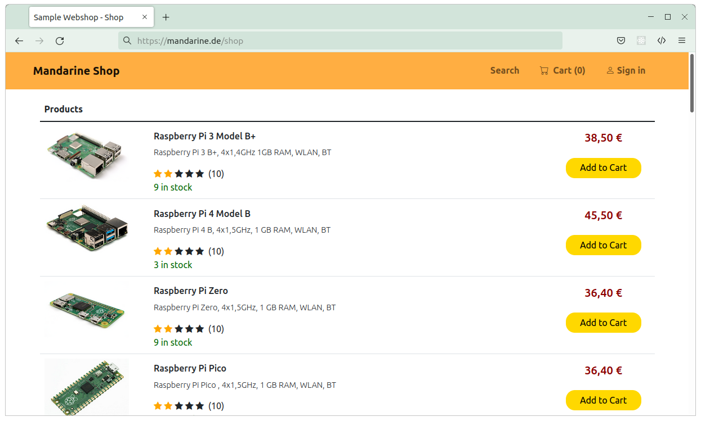
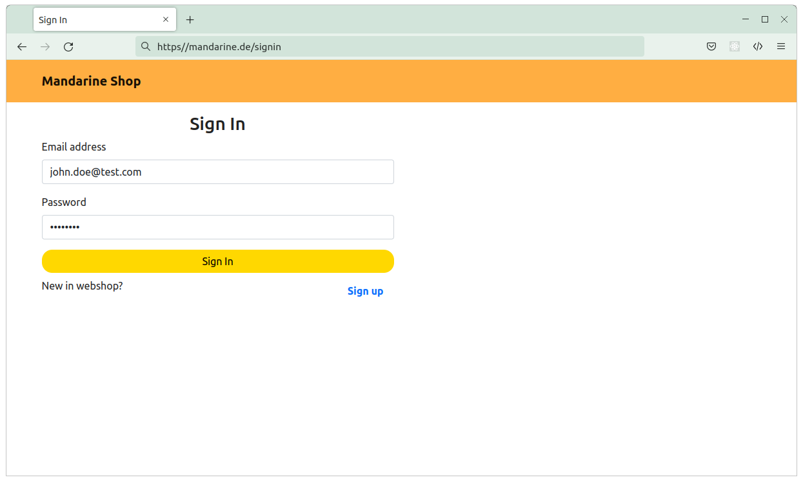
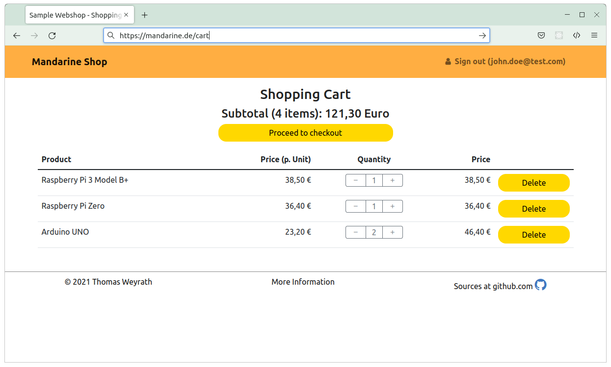
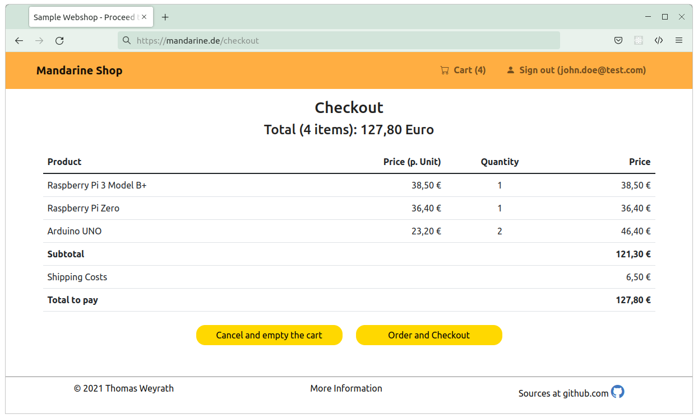

# Project Webshop
Reference implementation of a simple online shop with the spring boot framework.
The webshop application runs in the AWS cloud. Please contact me to get the URL in order to test it.

## Key Technologies
The following key technologies are used:

### for the backend
- Java 11
- Spring Boot 2  
  - Web
  - Security
  - JPA
  - mail
  - Thymeleaf
- Maria DB

### for the frontend 
- Bootstrap 5
- Html

## Usage
#### Mandarine shop product list
In the mandarine shop you can buy electric articles, e.g. single-board computers and their accessories.

### Mandarine shop sign in
To use the webshop you must sign in. Use one of the test accounts, 'john.doe@test.com' or 'jane.doe@test.com'. 

With Sign up You can also register with your email address. You get an email that you must confirm.
Then you can sign in with your email address and your password.

#### Mandarine shop cart
To order the goods you click on the shopping cart symbol. The program displays the shopping cart. 
There, you can change the number of ordered articles. Click at the button "proceed to checkout". 

#### Mandarine shop checkout
At the checkout side you see the total amount of the order. Then you can finish the order by cklicking the
button "order and checkout".

